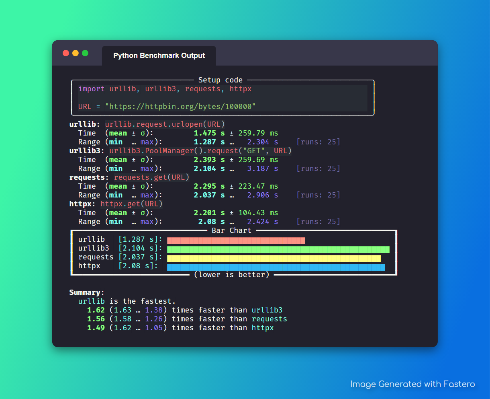

.. fastero documentation master file, created by
   sphinx-quickstart on Mon Apr 11 18:49:27 2022.
   You can adapt this file completely to your liking, but it should at least
   contain the root `toctree` directive.

#######
Fastero
#######

.. meta::
   :description: Python timeit CLI for the 21st century.
   :author: Arian Mollik Wasi
   :copyright: Arian Mollik Wasi
   :keywords: Python, Timeit, Fastero, Wasi Master, Arian Mollik Wasi
   :language: English
   :og:title: Fastero Documentation
   :og:site_name: Fastero
   :og:type: website
   :og:url: https://fastero.readthedocs.io
   :og:image: https://i.ibb.co/ysbFf3b/python-http-library-benchmark.png
   :og:description: Python timeit CLI for the 21st century. Fastero is a beautiful and flexible timeit (CLI) alternative that you have to check out
   :twitter:card: summary_large_image
   :twitter:title: Fastero Documentation
   :twitter:image: https://i.ibb.co/ysbFf3b/python-http-library-benchmark.png
   :twitter:description: Python timeit CLI for the 21st century. Fastero is a beautiful and flexible timeit (CLI) alternative that you have to check out
   :google-site-verification: upUCfyFeU0JcauOrq_fs4NssKvSo3FzLEnJBTWDBiHY

.. toctree::
   :hidden:
   :caption: Contents

   documentation/quickstart
   documentation/cli_reference
   documentation/cli_reference_automated
   documentation/exporting
   documentation/tips_recipies_and_notes

.. toctree::
   :hidden:
   :caption: Development

   development/contributing
   development/internal_structure
   development/workflows
   development/license

.. toctree::
   :hidden:
   :caption: Other

   genindex
   glossary

Python timeit CLI for the 21st century.

Indices and Tables
------------------

* `Documentation <./documentation/index.html>`_
   * `Quickstart <./documentation/quickstart.html>`_
   * `CLI Reference <./documentation/cli_reference.html>`_
   * `CLI Reference (Automated) <./documentation/cli_reference_automated.html>`_
   * `Exporting Reference <./documentation/exporting.html>`_
   * `Tips, Recipies, and Notes <./documentation/tips_recipies_and_notes.html>`_
* `Development <./development/index.html>`_
   * `Contributing <./development/contributing.html>`_
   * `Internal Structure <./development/internal_structure.html>`_
   * `License <./development/license.html>`_
   * `Workflows <./development/workflows.html>`_
* `Other <https://www.youtube.com/watch?v=dQw4w9WgXcQ>`_
   * `Glossary <./glossary.html>`_
   * `Index <./genindex.html>`_
